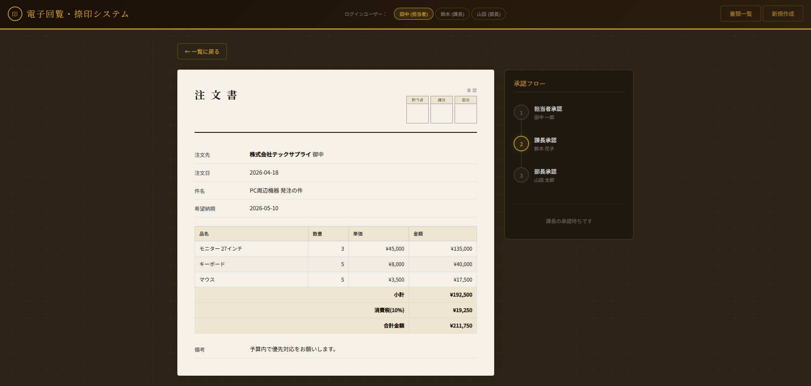

# 電子回覧・捺印システム

注文書などの社内書類をWebブラウザ上で回覧し、クリック一つで電子捺印できるワークフローシステムのサンプルです。  
サーバー不要・HTMLファイル一つで動作します。



---

## 概要

Excelとメールで行っていた書類の回覧・承認フローをWebベースで実現します。  
担当者 → 課長 → 部長 の3段階承認に対応し、各担当者がボタンをクリックするだけで電子印鑑が押印されます。

---

## 機能

- **書類一覧** — 回覧中の書類をステータス別（要承認 / 承認待ち / 完了）に一覧表示
- **電子捺印** — 「捺印する」ボタンで印鑑がアニメーション表示され、次の承認者へ自動で回覧
- **3段階承認フロー** — 担当者 → 課長 → 部長 の順に承認が進む
- **新規作成** — Webフォームで注文書を作成し、そのまま回覧に提出
- **PDF出力** — 捺印済み書類をPDFとしてダウンロード
- **ユーザー切替** — 画面上部のボタンで各承認者の視点に切り替え可能（デモ用）

---

## デモ

> **注意：** これはデモ用サンプルです。データはブラウザのメモリ上にのみ保存され、リロードするとリセットされます。

### 試し方

1. `index.html` をブラウザで開く
2. 右上のユーザー切替ボタンで **「田中（担当者）」** を選択
3. 書類を開いて **「ここに捺印する」** をクリック
4. **「鈴木（課長）」** に切り替えて捺印
5. **「山田（部長）」** に切り替えて捺印 → 承認完了！

---


---

## ファイル構成

```
/
├── index.html       # メインアプリ（これ一つで完結）
├── README.md
└── screenshots/
    ├── list.png     # 書類一覧画面
    └── detail.png   # 書類詳細・捺印画面
```

---

## 技術スタック

| 用途 | 技術 |
|------|------|
| UI | HTML / CSS / Vanilla JS |
| フォント | [Noto Serif JP / Noto Sans JP](https://fonts.google.com/) |
| PDF出力 | [jsPDF](https://github.com/parallax/jsPDF) + [html2canvas](https://html2canvas.hertzen.com/) |
| サーバー | 不要（静的HTMLのみ） |

---

## 今後の拡張予定

- [ ] ログイン認証（実際のユーザー管理）
- [ ] データベース連携（Supabase など）による永続化
- [ ] メール通知（次の承認者へ自動送信）
- [ ] 書類テンプレートの追加（見積書・請求書など）
- [ ] 既存 Excel ファイルのアップロード対応

---

## 注意事項

- 登場する会社名・人名はすべてフィクションです
- 本番運用には認証・データ永続化の実装が必要です

---

## ライセンス

MIT License
